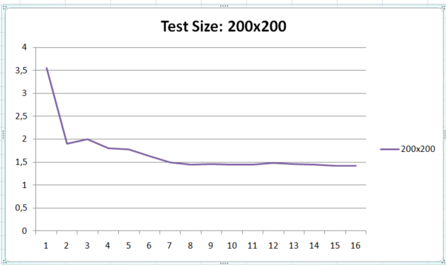

| Schelling Model 25/05/2021 |
| --- | --- | --- | --- |

# Soluzione Proposta

La soluzione proposta al problema del modello di segregazione di Schelling  è suddivisa in 4 fasi principali:

1.Lettura in input da parte del **rank 0** delle dimensioni della griglia, numero di agenti rossi, numero di celle vuote e soddisfazione (valida per ogni agente)
Dopodichè il processo 0 si occupa di dividere gli input e comunicarli agli altri processi.
 
2.Una volta che ogni processo ha inizializzato la proprio sotto-griglia e le strutture ausiliare esegue una richiesta delle righe adiacenti e verifica per ogni cella il grado di soddisfazione salvando le informazioni <ins>del processo di partenza,di destinazione e le coordinate locali alla griglia.</ins> Questa  struttura di supporto è fondamentale per lo scambio, ed è chiamata UnHappy.
Quindi ogni processo avrà un elenco di celle insoddisfatte, tale numero viene comunicato a tutti e viene individuata la somma e il numero massimo.

3.La lista di tipo *UnHappy* in questo momento non è sincronizzata con gli altri processi e di conseguenza ogni processo presenta una lista differente, si usa un analogo principio di gathering utilizzato nel punto 2 in modo da avere l’elenco di tutte le celle non soddisfatte.

4.L’ultima fase consiste nello spostamento delle celle non soddisfatte, dove analizzando la lista unHappy ogni processo controlla se il **processo di destinazione è se stesso**, modifica la griglia e marca l’i-esima posizione della lista. La fase finale consiste nel sincronizzare la lista e inserire il vuoto nella cella precedentemente spostata.

Il punto 1 si occupa di assegnare, per le celle insoddisfatte, un processo che è generato casualmente ciò implica che dato lo stesso input **è possibile avere output differenti e tempi di esecuzioni differenti** dato la casualità della selezione e l'impatto aumenta con l'aumentare il numero dei processi.
Il punto 4, invece consiste nello “spostare” la cella sulla griglia, tale operazione non segue una logica casuale ma bensì una volta che è stato selezionato il processo prende la prima disponibile e la occupa con il valore presente nella lista sincronizzata.


# Implementazione e descrizione dettagliata

Per comprendere le parti salienti è necessario partire dalle strutture dati utilizzate.

```C

enum STATUS {
    RED, BLUE, EMPTY,PADDING
};

typedef struct {
    enum STATUS status;
    bool locked;
    float satisfacion;
} City;
```

Questa struttura rappresenta una griglia di dimensioni NXN, quindi sarà una matrice *City[N][N]* ed ogni processo creerà una sottomatrice *City[N/processi][N]* la popolerà e gestirà durante l'arco dell'esecuzione.
Lo status non è altro che il possibile stato in cui si può trovare una cella, come si denota facilmente dall'enumeratore.

Le altre strutture utilizzate sono 
```C
typedef struct {
    int row;
    int col;
    int satisfation;
    int red;
    int blue;
} InitializeMsg;
-------------------

enum ALLOCATION {
    ALLOCATED,
    NOT_ALLOCATED,
    INVALID
};

typedef struct {
    int original_proc;
    int destination_proc;
    int x;
    int y;
    int last_edit_by;
    enum STATUS content;
    enum ALLOCATION allocation_result;
} UnHappy;
```
La prima struttura è utilizzata da parte del rank 0 per inviare le informazioni agli altri processi:
    - row: rappresenta il numero di righe assegnato a quel processo.
    - col: rappresenta il numero di colonne assegnato a quel processo.
    - satisfaction: la soddisfazione presa in input
    - red: il numero di celle rosse assegnate a quel processo
    - blue: il numero di celle blu assegnate a quel processo

Ogni processo quindi si crea una matrice **row*col** e inizializza la propria matrice tenendo conto delle celle rosse e blu ricevute.

La seconda struttura, invece risulta essere il perno centrale per lo scambio.
    -original_proc: rappresenta il processo che ha verificato l'adiacenza
    -destination_proc: processo generato casualmente e che **dovrebbe** essere la destinazione finale della cella nella fase di spostamento
    -x,y: posizioni x-y locali sulla griglia
    -last_edit_by: marcatore per indicare che la cella è stata spostata da x-processo
    -content: contenuto
    -allocation_result: risultato dell'allocazione o padding.

In fase di verifica delle adiacenze di ogni cella e se quest'ultima dovesse risultare **minore satisfaction** verrà creata questa struttura.

```C
if ((int) **grid_city[i][j].satisfacion** < satisfaction) {
                    UnHappy unHappy;
                    unHappy.content = grid_city[i][j].status;
                    unHappy.x = i;
                    unHappy.y = j;
                    unHappy.last_edit_by = -1;
                    unHappy.allocation_result = NOT_ALLOCATED;
                    unHappy.original_proc = proc;
                    unHappy.destination_proc = **rand() % last_process**; //Assegnazione casuale del processo!
                    unhappy_list[unsatisfaied++] = unHappy;
                }
```

Ognuno di queste strutture ha un corrispetivo tipo committato su mpi, i metodi che si occupano della creazione dei vari tipi sono

```C
MPI_Datatype mpi_initialize_message_type = make_type_for_initialize_msg();
MPI_Datatype mpi_city_type = make_type_for_city();
MPI_Datatype mpi_unhappy = make_type_for_unhappy();
..
...
...
MPI_Type_free(&mpi_city_type);
MPI_Type_free(&mpi_initialize_message_type);
MPI_Type_free(&mpi_unhappy);

```

Per ottenere la soddisfazione, partiamo da una serie di immagini che semplificano il contesto delle azioni da fare.

Supponiamo di avere questa matrice di dimensioni 6x6, dove il rosso e l'azzurro sono i due agenti.


Ora prendiamo in considerazione la riga 5 colonna 2 come indicato in figura


I punti indicati in nero sono quelli da verificare, supponiamo che questa matrice è stata divisa tra due processi denominati di seguito **P0** - **P1**, come mostrato di seguito


Dove la linea in giallo rappresenta ciò che è necessario sapere da **P0** affinchè **P1** possa verificare le sue adiacenze, analogo discorso per **P0** che ha bisogno della riga 4.
Un ulteriore caso è rappresentato invece da un processo che si trova *al centro* quindi che non corrisponde **nè all'ultimo nè al primo**
In quel caso ha bisogno della riga superiore appartenente a **Px-1** e della riga successiva appartenente a **Px+1**

Queste operazioni vengono eseguite tramite una send e receive da ogni processo, che ha necessità di attendere queste informazioni per poter proseguire.

```C
void
do_request(int proc, City **grid_city, City **cache, int row, int col, int last_processor,
           MPI_Datatype mpi_city_type){

if (proc == 0) {
            MPI_Send(grid_city[row - 1], col, mpi_city_type, proc + 1, 2, MPI_COMM_WORLD);
            MPI_Recv(cache[1], col, mpi_city_type, proc + 1, 1, MPI_COMM_WORLD, &status1);
        } else if (proc == last_processor - 1) {
            MPI_Send(grid_city[0], col, mpi_city_type, proc - 1, 1, MPI_COMM_WORLD);
            MPI_Recv(cache[0], col, mpi_city_type, proc - 1, 2, MPI_COMM_WORLD, &status1);

        } else {
            MPI_Send(grid_city[0], col, mpi_city_type, proc - 1, 1, MPI_COMM_WORLD);
            MPI_Send(grid_city[row - 1], col, mpi_city_type, proc + 1, 2, MPI_COMM_WORLD);
            //ricezione
            MPI_Recv(cache[0], col, mpi_city_type, proc - 1, 2, MPI_COMM_WORLD, &status1);
            MPI_Recv(cache[1], col, mpi_city_type, proc + 1, 1, MPI_COMM_WORLD, &status2);

        }

}

```

Gli unici casi in cui non si deve inviare/ricevere sia da **Px-1** che **Px+1** sono il primo e l'ultimo processo-

Il confronto a questo punto risulta semplice: se non rientra nel range della matrice significa che bisogna andare a recuperare da questo vettore *cache*

```C
//caso di controllo in alto a sinistra

                int no_x = i - 1; //riga precedente
                int no_y = j - 1; //colonna precedente
                if (no_x >= 0 && no_y >= 0) { //se rientro nel range verifico sulla matrice locale
                    check_satisfaction_oblique(grid_city, i, j, no_x, no_y, &count_near, &satisf);
                } else {
                    if (no_y >= 0 && proc != 0) { //se non sono andato in una posizione invalida e non sono P0 (P0 sopra di esso non ha nulla) verifico in cache
                        check_satisfaction_oblique_on_cache(grid_city, cache, i, j, 0, no_y, &count_near, &satisf);
                    }
                }

```

Ogni processo invia il proprio conteggio degli insodisfatti e mantiene in memoria la lista degli insodisfatti.
Ogni processo fa gather verso tutti e successivamente calcola il totale e il massimo degli insodisfatti

```C
int unsaf[processes];
        MPI_Allgather(&local_unsatisfied, 1, MPI_INT, unsaf, 1, MPI_INT, MPI_COMM_WORLD);
        unsatisfied_max_and_sum(unsaf, **&max_unsatisfied**, &tot_unsatisfied, processes);
```

Il massimo ci servirà per fare padding per quei processi che hanno un numero minore di *insodisfatti*

```C
UnHappy *unHappy_all_proc = gather_unhappy(unhappy_list, max_unsatisfied, processes, mpi_unhappy);
 
 //corpo di gather_unhappy
 int size = unsatisfied * processes; //ogni processo avrà la lista complessiva degli insodisfatti.

```
Supponendo di avere 3 processi **P0-P1-P2** avremo una situazione del genere dopo il gathering delle liste.


Ora che ogni processo sa coloro che **vogliono spostarsi** e anche **dove** ogni processo non deve far altro
che controllare questa lista e verificare se il **processo di destinazione è lui**

Prende la prima cella libere a la occupa, **senza preoccuparsi di liberare quella antecedente**.
```C
search_first_empty(grid_city, row, col, &nx, &ny);
            if (nx != -1 && ny != -1) {
                grid_city[nx][ny].status = unhappy_list[i].content;
                grid_city[nx][ny].locked = true;
                grid_city[nx][ny].satisfacion = 0;
                unhappy_list[i].allocation_result = ALLOCATED;
                unhappy_list[i].last_edit_by = rank;
            } else {
                int new_proc = 0;
                do {
                    new_proc = rand() % processes;
                } while (new_proc == rank);
                unhappy_list[i].destination_proc = new_proc;
                unhappy_list[i].last_edit_by = rank;
            }
```
L'assegnazione al last_edit_by funziona come da marcatore, quindi ogni processo avrà una lista con le celle marcate.
Di conseguenza bisogna creare **un' unica lista comune tra tutti i processi**
Di seguito l'immagine che illustra visivamente il concetto:


Ogni processo ha provato ad allocare le celle destinate ad esso, in questo caso riuscendoci e **marcandolo con il proprio rank** e il valoce **A**
per lo stato di allocazione (N: Non allocato A: Allocato)
La fase di sincronizzazione della lista avviene tramite una reduce e un **operatore ridefinito**, che si occupa proprio di fare il
join dell'immagine vista sopra e "distribuirlo a tutti i processi"

```C
//definizione operatore
 MPI_Op_create((MPI_User_function *) difference_unhappy, false, &mpi_unhappy_difference);

//utilizzo
//temp=lista del singolo processo
MPI_Allreduce(temp, total_proc, size, mpi_unhappy, mpi_unhappy_difference, MPI_COMM_WORLD);

//Funzione dell'operatore
void difference_unhappy(UnHappy *in, UnHappy *inout, int *len, MPI_Datatype *dtype) {
    for (int i = 0; i < *len; ++i) {
        if (in[i].last_edit_by != -1 && in[i].allocation_result != INVALID) {
            inout[i].allocation_result = in[i].allocation_result;
            inout[i].destination_proc = in[i].destination_proc;
            inout[i].last_edit_by = in[i].last_edit_by;
        }
    }
}

```

L'ultima fase consiste semplicemente nello scorrere la lista ricevuta e verificare se è stato allocato e il processo originario 
corrisponde a quello attuale, allora non si fa altro che aggiornare la griglia con le celle vuote. 

# Performance e Scalabilità

I test sono stati eseguiti su un cluster di macchine **m4.xlarge** EC2 di AWS.
Il modello di Schelling dato che potrebbe richiedere **tempi di esecuzione differenti anche sullo stesso input** i seguenti grafici sono il
risultato di una media di esecuzioni.
Altro parere da tenere presente che con griglie molto grandi e poco spazio è molto facile finire in un loop, per questo motivo i test sono stati effettuati
su griglie che dovrebbero avere spazio a sufficienza per essere risolti oppure con agenti che non dovrebbero avere un grado di soddisfazione molto alto.

Le taglie scelte per i test sono 3: *20x20* - *50x50* - *80x80*

Per avere lo stesso input all'interno del progetto è stata modificata la generazione del numero casuale mettendo come
seed il rank. Ovviamente ciò comporta anche a una scelta *"meno casuale"* del processo di destinazione 

## Criteri di misurazione

Per avere un misurazione realistica sono state escluse le operazioni non necessarie ai fini del calcolo della risoluzione del problema.
Per tanto sono state escluse le due stampe della griglia, rispettivamente all'inizio dopo la generazione delle sottomatrici e alla fine dopo aver risolto
il problema.
Inoltre sono stati esclusi i tempi di generazioni delle stesse sottomatrici.
E' stato particolarmente utile il sito *http://nifty.stanford.edu/2014/mccown-schelling-model-segregation/* nel trovare un punto di equilibrio per eseguire 
i test evitando loop infiniti.

Inoltre è stato creato un hfile per ogni nodo del cluster, specificando esclusivamente il numero di slots
```bash
172.31.52.73 slots=4
172.31.55.87 slots=4
172.31.57.40 slots=4
172.31.62.63 slots=4

```

## Compilazione - Esecuzione e parametri

Dato che il programma non presenta librerie e/o più file la compilazione si esegue con un semplice comando.

```bash
mpicc main.c -o schelling
```
L'esecuzione avviene tramite **mpirun**, specificando l'hostfile precedentemente creato

```bash
mpirun -np [N_PROC] --hostfile hfile ./schelling [SIZE] [EMPTY_CELL] [BLU AGENT] [SATISFACTION] 
```

E' anche possibile lanciarlo senza argomenti, ma per una questione di comodità in fase di benchmark è stata utilizzata la versione
con gli argomenti.

## Scalabilità forte

Per i test sulla scalabilità forte è stato scelto un input di **20x20** - **50x50** - **80x80** - **200x200**
Il test su 20x20 è stato impostato con i seguenti parametri:
*Size*: 20
*Empty*: 150
*Blue* 140
*Satisfaction* 60

Il test su 50x50 è stato impostato con i seguenti parametri:
*Size*: 50
*Empty*: 500
*Blue*: 1000
*Satisfaction*: 50

Il test su 80x80 è stato impostato con i seguenti parametri:
*Size*:80
*Empty*: 1280
*Blue*: 2500
*Satisfaction*: 60

Il test su 200x200 è stato impostato con i seguenti parametri:

*Size*:200
*Empty*: 9000
*Blue*: 16000
*Satisfaction*: 60

I test sono stati ripetuti più volte per ogni incremento di processori, i grafici risultanti sono una media.

Di seguito i risultati in termini di tempo al variare del numero di processori.




Come si nota nell'immagine con dimensioni 20x20 non **c'è nessun miglioramento delle performance** anzi un decadimento di quest'ultime dovute
ad un inutile overhead di comunicazione della lista sincronizzata tra i vari processi.
Le matrici con una taglia minore di 20 presentano un decadimento delle prestazioni ma non così eccessivo.

La situazione cambia notevolmente se si eseguono istanze con una griglia poco più grande, come nel caso di **50x50** e **80x80**,
dove si ha un netto miglioramento delle prestazioni dal 3 processore in poi.
Nel caso di **200x200* si ha un miglioramento iniziale molto alto, ma con l'aumentare dei processori il miglioramento è poco considerevole,
soprattutto dal 8° processore in poi.


##Scalabilità debole

Alcuni dei test effettuati per la scalabilità debole sono validi anche per la scalabilità forte, dato che la divisione delle matrici è data
da **N/P**, dove **N** rappresenta il numero di righe e **P** il numero di processori.
Questo significa che test 

```
  P0=20/2=10
  P1=20/2=10 

```

Nel caso di size **20** e 2 processori avranno esattamente la stessa matrice da gestire e così per altri casi eseguiti in precedenza.

I test effettuati variando le dimensioni della matrice per avere costantemente 100 elementi 


